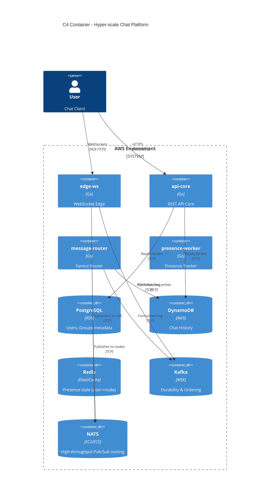
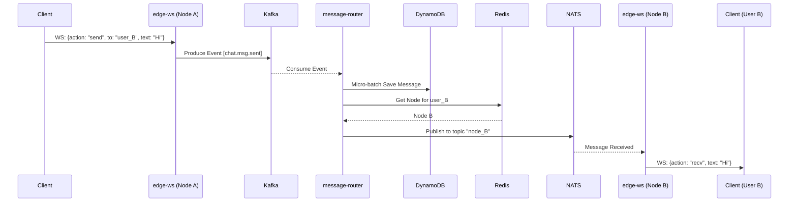
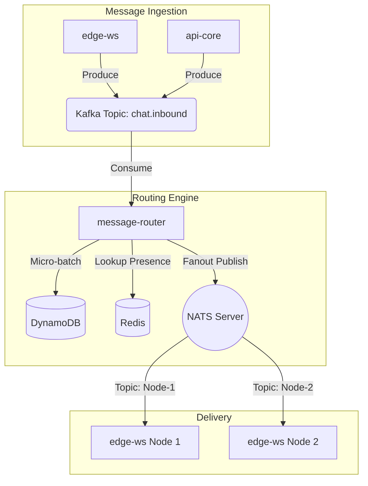
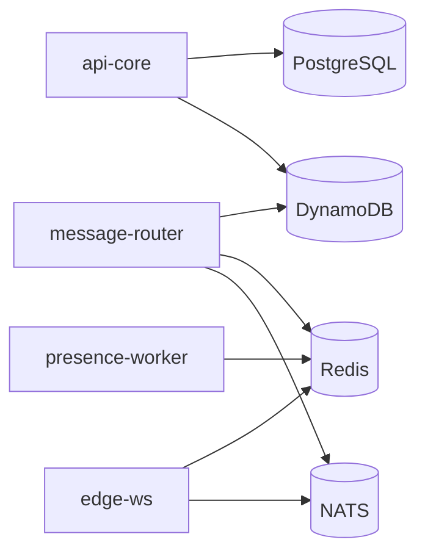
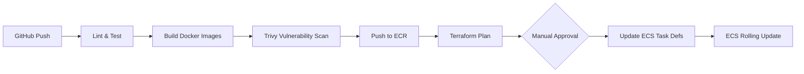

# Real-time Chat Platform

**Tagline:** Hyper-scale WebSocket server in Go using epoll, NATS fanout routing, and micro-batching.
**Language:** Go
**Cloud:** AWS
**Architecture Style:** Clean Architecture (Domain-Driven Design for Core) + Layered (Edge)
**Production Posture:** Production-grade system supporting 1M concurrent connections, multi-team ownership, and high availability.

---

## 1. Overview & Outcomes

**Problem:** Modern social and communication applications require real-time message delivery with minimal latency. Scaling WebSockets to millions of concurrent connections on minimal hardware is a deep technical challenge that requires understanding of OS-level network I/O, memory management, and high-throughput distributed fan-out routing.

**Traffic Profile (Hyper-scale):**
- **Peak Concurrent Connections:** 1,000,000 (steady state).
- **Message Throughput:** 500,000 messages/sec (peak), 200,000 messages/sec (normal).
- **Payload:** Small JSON payloads (avg 256 bytes).
- **Read/Write Mix:** 90% Read (delivered messages), 10% Write (sent messages).

**Production Posture:**
This is designed as a multi-team system:
- A Platform team manages the WebSocket Edge, NATS routing infrastructure, and NLBs.
- A Product team manages the REST APIs for chat history, user profiles, and groups.
- An SRE team handles the underlying AWS compute, Kafka, Redis, and DynamoDB infrastructure.

**Team Ownership:**

| Team | Mission | Owns Services | On-call Rotation | Escalation |
|---|---|---|---|---|
| Platform/Infra | High-concurrency edge & routing | `edge-ws`, `message-router` | 24/7 Primary | SRE |
| Core Product | Metadata, history, profiles | `api-core`, `presence-worker` | Business Hours | Core Tech Lead |

**Learning Outcomes:**
- Mastering Go concurrency and memory management for 1M long-lived connections.
- Implementing zero-allocation or low-allocation WebSocket parsers.
- Distributed Pub/Sub fan-out architecture using NATS for ultra-high throughput.
- Advanced AWS deployment for persistent connections (NLB timeout tuning).
- DynamoDB micro-batching to handle 50,000 writes/sec cost-effectively.

**Non-Goals:**
- End-to-end encryption (E2EE) cryptographic key management.
- Video/Voice calling (WebRTC).
- Cross-region active-active replication (focused on Multi-AZ within a single Region).

---

## 2. Architecture at a Glance

### 2.1 Architecture Style & Discipline
- **Mix:** Clean Architecture (for `api-core`) combined with a lightweight Pipeline/Layered pattern (for `edge-ws`).
- **Why:** `api-core` handles complex business rules (group permissions, auth, historical pagination) and warrants Domain-Driven Design (DDD) inside a Hexagonal structure. Conversely, `edge-ws` is a pure data-plane service focused on raw I/O throughput; forcing DDD aggregates there would be cargo-culting. We use a lightweight router/handler pattern for the edge.
- **Baseline:** SOLID principles apply idiomatically in Go (small interfaces, composition over inheritance).
- **DRY:** Duplication of simple DTOs across `api-core` and `message-router` is accepted to avoid a shared "common" module that couples deployments.
- **Industry Reference:** This hybrid approach mirrors Discord's architecture, where the Gateway (WebSocket edge) is a thin, highly optimized I/O layer (originally Elixir, moved to Rust) while the core API handles heavy business logic (Python/Go). The NATS routing layer mirrors practices seen in high-throughput ad-tech and trading platforms.

### 2.2 Services

| Service | Team | Responsibility | Sync APIs | Async consume/produce | Data owned | Scaling unit | SLO |
|---|---|---|---|---|---|---|---|
| `edge-ws` | Platform | Holds WebSocket conns. | WS Upgrade | Sub NATS, Pub Kafka | Ephemeral conn state | CPU/Memory | 99.9% uptime |
| `message-router` | Platform | Routes messages to edge. | None | Sub Kafka, Pub NATS | Routing table | CPU | <50ms latency |
| `api-core` | Product | History, Users, Groups | REST API | Pub Kafka | Users, Groups, Msgs | CPU | <100ms latency|
| `presence-worker`| Product | Tracks online status | None | Sub Redis | Presence state | CPU | N/A |

### 2.3 Components
- **Connection Pooler:** Custom Go component using `epoll` / `kqueue` (via libraries like `gobwas/ws` or `gnet`) to hold 100K+ connections per node with minimal goroutine overhead.
- **Fan-out Engine:** NATS subscriber that multiplexes incoming messages to the correct local connection descriptors.
- **Micro-batcher:** Go channels and tickers in `message-router` that buffer incoming Kafka messages for 50-100ms before doing a `BatchWriteItem` to DynamoDB.

### 2.4 Folder Map (Dependency Rule Encoded)
```text
.
├── Makefile
├── docker-compose.yml
├── deploy/
│   └── ecs/                 # ECS Fargate task definitions, NLB/ALB configs
├── infra/
│   └── terraform/
│       └── modules/         # vpc, ecs, rds, dynamodb, elasticache, nats
├── .github/
│   └── workflows/           # ci.yml, deploy.yml
└── src/
    ├── api-core/            # Clean Architecture
    │   ├── Dockerfile
    │   ├── cmd/api/
    │   ├── internal/
    │   │   ├── domain/      # Entities, Repository Interfaces
    │   │   ├── usecase/     # Business logic
    │   │   └── adapter/     # HTTP Handlers, Postgres Repo
    ├── edge-ws/             # I/O Pipeline Architecture
    │   ├── Dockerfile
    │   ├── cmd/edge/
    │   └── internal/
    │       ├── connection/  # Epoll/WS wrapper
    │       └── router/      # NATS Pub/Sub to Conn mapping
    ├── message-router/
    │   ├── Dockerfile
    │   └── cmd/router/
    └── presence-worker/
        ├── Dockerfile
        └── cmd/worker/
```

### 2.5 Suggested Implementation Sequencer
1. Monorepo setup & CI pipeline skeleton.
2. `api-core`: PostgreSQL setup, Auth, User/Group CRUD.
3. `edge-ws`: Basic WebSocket upgrade and echo server (epoll).
4. `message-router` & Kafka: End-to-end message delivery flow, DynamoDB Micro-batching.
5. `presence-worker`: Redis integration for online status, NATS routing.

---

## 3. System Topology & Scale

### Diagram 1: C4 Container / Architecture Overview


### Diagram 2: Detailed Request Path (Message Send)


### Diagram 3: Write Path & Event Flow (Fanout)


### Diagram 4: Storage Ownership


### Diagram 5: Multi-AZ HA Topology
```mermaid
flowchart TD
    Internet --> NLB[Network Load Balancer (TCP)]
    Internet --> ALB[Application Load Balancer (HTTP)]
    
    ALB --> TG_API[Target Group: api-core]
    NLB --> TG_WS[Target Group: edge-ws]
    
    subgraph AZ A
        TG_API --> A_API[api-core task]
        TG_WS --> A_WS[edge-ws task]
    end
    
    subgraph AZ B
        TG_API --> B_API[api-core task]
        TG_WS --> B_WS[edge-ws task]
    end
    
    A_API --> MultiAZ_RDS[(RDS Multi-AZ)]
    B_API --> MultiAZ_RDS
```
*Note: NLB is explicitly used for `edge-ws` to support 1M+ raw TCP connections with extremely low latency, avoiding ALB connection state limits.*

### Diagram 6: CI/CD Pipeline & Deploy Topology


---

## 4. DDD (Domain-Driven Design)

For `api-core` only (domain complexity warrants it):

**Bounded Contexts:**
- **Identity:** Users, Authentication.
- **Social:** Groups, Memberships, Friendships.
- **Chat:** Messages (mostly interacted via `message-router`).

**Aggregates:**
- `Group`: Manages membership rules, roles, and limits. (Entity)
- `User`: Profile, preferences. (Entity)

**Domain Events:**
- `UserStatusChanged`: Emitted when presence changes.
- `MessageSent`: Core event flowing through Kafka.

---

## 5. Storage & Data

| Store | Role | Owner | Schema/Keys | Access Pattern | Consistency | Backup |
|---|---|---|---|---|---|---|
| PostgreSQL | Metadata | `api-core` | `users(id, name)`, `groups(id, type)`, `members(user_id, group_id)` | Highly relational, joins | Strong | Daily Snapshot |
| DynamoDB | Chat History | `api-core`, `msg-router` | PK: `channel_id`, SK: `timestamp#msg_id` | Time-series pagination | Eventual | PITR |
| Redis | Presence | All | `user:{id}:node` -> `node_id` | Key-Value | Ephemeral | None |
| Kafka | Event Bus | All | Topics: `chat.inbound`, `chat.presence` | Append-only log | Strong/Ordered | Replicated |
| NATS | Routing Fanout| `msg-router`, `edge-ws`| Topics: `node.{node_id}` | Pub/Sub memory routing | Ephemeral | None |

**Micro-batching Strategy (DynamoDB):**
Writing 50,000 items/sec (10% of 500K peak) individually to DynamoDB is cost-prohibitive. `message-router` uses a buffered channel to collect messages, flushing them to DynamoDB using `BatchWriteItem` every 100ms or 25 items (whichever comes first). This reduces Write Request Units drastically.

---

## 6. Language Mastery (Go)

- **`sync.Pool`:** Used extensively in `edge-ws` to pool WebSocket message buffers and avoid GC pressure on 1M connections.
- **Goroutine per connection vs Epoll:** Standard `net/http` uses one goroutine per connection (expensive for 1M). We will use `gobwas/ws` with custom epoll loops to handle thousands of connections per goroutine.
- **Micro-batching Concurrency:** `select` statements with `time.Ticker` in worker pools to efficiently batch DynamoDB writes.
- **`context.Context`:** Passed through all AWS SDK and DB calls to enforce strict timeouts.
- **`pprof`:** Enabled on a private debug port to monitor heap allocations and goroutine leaks in `edge-ws`.

---

## 7. API & Events

**REST API (`api-core`):**
| Method | Path | Purpose | Auth | Idempotent |
|---|---|---|---|---|
| POST | `/v1/users/auth` | Login/Token exchange | None | Yes |
| GET | `/v1/channels/{id}/messages` | Paginated history | JWT | Yes |
| POST | `/v1/channels` | Create group | JWT | No |

**WebSocket (`edge-ws`):**
- **Endpoint:** `wss://chat.domain.com/ws`
- **Protocol:** JSON payloads. `{ "type": "auth", "token": "..." }`, `{ "type": "msg", "channel": "...", "text": "..." }`

**Events (Kafka):**
| Topic | Payload Fields | Producer | Consumers | Ordering |
|---|---|---|---|---|
| `chat.inbound` | `msg_id, sender_id, channel_id, text, ts` | `edge-ws` | `message-router` | Keyed by `channel_id` |

---

## 8. Security & Abuse

- **Authentication:** Short-lived JWTs passed as the first WebSocket message after connection (don't pass in query string to avoid logging).
- **Rate Limiting:** IP-based rate limiting at the WAF level, and user-based token bucket rate limiting inside `edge-ws` (max 5 msgs/sec per user).
- **Abuse:** Connections sending malformed JSON or exceeding rate limits are forcefully closed.
- **Secrets:** Stored in AWS Secrets Manager, injected via ECS Task Execution Roles (no secrets in env vars).

---

## 9. Resilience, SLO & Operability

**SLO:**
- Availability: 99.99% successful WS handshakes.
- Latency: < 100ms from sending a message to the recipient's edge node receiving it.

**Dependency Table:**
| Caller | Dep | Timeout | Retry | Circuit Breaker | Fallback |
|---|---|---|---|---|---|
| `edge-ws` | Kafka | 500ms | 3x exponential | Yes | Drop connection with error |
| `msg-router`| DynamoDB | 2s | 3x | Yes | DLQ Kafka topic |
| `api-core` | Postgres | 2s | None | No | 500 Internal Error |

**On-call Alerts:**
- Paging: `edge-ws` CPU > 70%, Kafka Consumer Lag > 10,000, NATS slow consumer drops.
- Ticket: High memory usage, slow Postgres queries.

---

## 10. DevOps — Docker, Compose, IaC, Orchestration, CI/CD

### 10.1 Docker
| Service | Base Image | Multi-stage | Ports | Healthcheck | User |
|---|---|---|---|---|---|
| `edge-ws` | `alpine:latest` (from `golang:1.22-alpine`) | Yes | 8080 | `/health` (HTTP) | `nonroot:nonroot` |
| `api-core` | `alpine:latest` | Yes | 8081 | `/health` | `nonroot:nonroot` |

### 10.2 Docker Compose (Local)
- `docker-compose.yml` includes all 4 Go services, plus `postgres:15`, `redis:7-alpine`, `nats:latest`, `confluentinc/cp-kafka`, and `amazon/dynamodb-local`.
- Verify: `docker compose up --build -d`.

### 10.3 Terraform / IaC (AWS)
- **State:** S3 bucket + DynamoDB locking table.
- **Modules:**
  - `vpc`: Public/Private subnets, NAT Gateway.
  - `rds`: Postgres 15 Multi-AZ.
  - `dynamodb`: On-demand capacity mode, string PK.
  - `ecs_cluster`: Fargate cluster.
  - `ecs_service`: Task definitions, IAM roles. NLB for edge, ALB for API.

### 10.4 AWS Compute: ECS Fargate
- **Configuration:** `edge-ws` tasks run with 4 vCPU / 8GB RAM to hold massive socket buffers. AWS Fargate supports up to 1M open files (ulimit) out of the box now. NLB handles layer-4 routing with extreme efficiency.

### 10.5 CI/CD
- **Tool:** GitHub Actions.
- **Pipeline:** `lint` -> `test` -> `docker build` -> `trivy scan` -> `aws ecr push` -> `terraform apply`.
- **Rollback:** Re-run the GitHub Action with the previous image tag, updating the ECS task definition.

### 10.6 Config, Secrets, Observability
- **Config:** Environment variables loaded via Viper.
- **Secrets:** ECS pulls directly from Secrets Manager.
- **OTel:** OpenTelemetry Go SDK integrated. Traces exported to AWS X-Ray.

### 10.7 Cost
- DynamoDB write costs (mitigated by micro-batching), NAT Gateway data transfer, and Fargate compute are the primary cost drivers.

---

## 11. Acceptance Criteria / DoD
- [ ] `docker compose up` starts the entire architecture locally (including NATS).
- [ ] ECS Fargate deployment succeeds via GitHub Actions behind an NLB.
- [ ] Load test using `k6` verifies 100K+ connections per node without crashing.
- [ ] DynamoDB writes show 90% reduction in WCUs due to micro-batching.

---

## 12. Appendix

**Top ADRs:**
1. **Architecture Style:** Clean Architecture for Core, Pipeline for Edge.
2. **Compute Choice:** ECS Fargate (Avoids K8s operational burden while supporting required scale).
3. **Message Fanout (AMENDED):** Swapped Redis for NATS. At 500K msgs/sec, Redis CPU bottlenecks. NATS handles massive fanout efficiently.
4. **Load Balancer (AMENDED):** Swapped ALB for NLB. ALBs struggle with 1M persistent connections due to state tracking; NLB routes TCP packets flawlessly at scale.

**Version Pinning:**
| Component | Pinned Version | Note |
|---|---|---|
| Go Runtime | `1.22` | Core language |
| Edge Framework | `github.com/gobwas/ws v1.3.2` | Zero-allocation WS |
| NATS Server & Go Client | `2.10` / `v1.31` | High-throughput pub/sub |
| API Framework | `github.com/go-chi/chi/v5 v5.0.12` | Standard REST router |
| PostgreSQL | `15.4` | Metadata DB |
| Redis | `7.2` | Presence Only |
| Kafka | `3.6` | MSK / Confluent |
| Terraform AWS Provider | `~> 5.0` | Infra |
